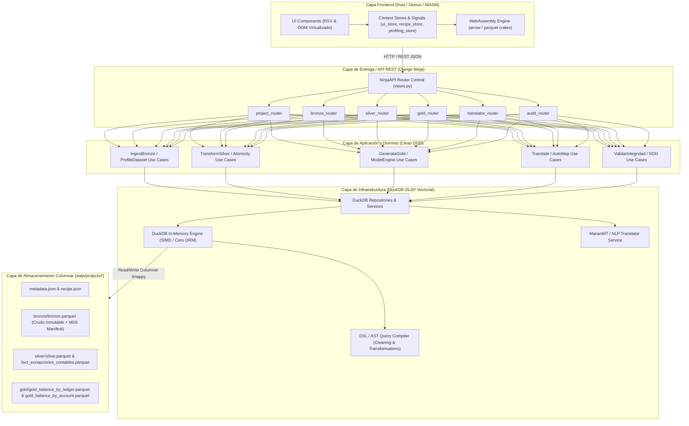

# 🏛️ Documento de Arquitectura del Sistema - Datamart Financiero ERP (Pry_Grd)

---

## 📋 Resumen Ejecutivo

**Pry_Grd** es una plataforma de ingeniería de datos y analítica financiera contable para la ingesta, limpieza, estructuración y generación de Datamarts ERP (Oracle EBS) a gran escala. El sistema procesa cientos de miles de registros contables en milisegundos utilizando un modelo de **Arquitectura Medallón (Bronze ➔ Silver ➔ Gold)** guiado por **Clean Architecture / Domain-Driven Design (DDD)**.

La solución combina un **Backend vectorial in-memory (Django Ninja + DuckDB + Apache Parquet)** libre de ORM pesado con un **Frontend de ultra alto rendimiento en Rust (Dioxus + WebAssembly)** capaz de virtualizar grandes volúmenes de datos a 60 FPS en el navegador.

---

## 📐 1. Diagrama de Arquitectura Global del Sistema



---

## 🛠️ 2. Stack Tecnológico

| Capa | Tecnología | Propósito y Justificación |
| :--- | :--- | :--- |
| **Backend Framework** | **Python 3.12+ / Django Ninja** | API REST asíncrona de ultrabaja latencia con validación mediante Pydantic DTOs y documentación OpenAPI automática. |
| **Motor de Cómputo Analítico** | **DuckDB Native (`:memory:`)** | Base de datos OLAP in-memory con ejecución vectorial SIMD. Elimina el cuello de botella de los ORMs tradicionales procesando +100k registros en < 40ms. |
| **Formato de Persistencia** | **Apache Parquet (Snappy)** | Almacenamiento columnar de alta densidad con compresión del 75%-80% frente al CSV original. |
| **Frontend Principal** | **Rust 2021 / Dioxus 0.7 (WASM)** | SPA compilada a WebAssembly con gestión de estado basada en Signals y renderizado virtualizado para tabla de datos a 60 FPS. |
| **Frontend Legacy** | **React 18 / TypeScript / Vite / Zustand** | Arquitectura SPA previa modularizada para compatibilidad y transición progresiva. |
| **Módulo de Traducción IA** | **MarianMT / NLP Transformers** | Mapeo semántico de campos ERP y traducción automática de esquemas heterogéneos. |
| **Auditoría Forense** | **Módulo de Reglas y DTOs Puros** | Aislamiento de excepciones contables y validación de reglas Maker/Checker y Partida Doble. |
| **Gestión de Entorno** | **uv / Cargo** | Manejo ultra rápido de dependencias en Python (`uv`) y Rust (`cargo`). |

---

## 🏛️ 3. Principios de Arquitectura y Patrones de Diseño

### 1. Cero ORM y Procesamiento Vectorial Columnar
- **El problema:** Los ORM tradicionales instancian cada fila contable como un objeto Python en memoria RAM, generando consumo extremo de memoria y tiempos de ejecución lentos en sumatorias contables.
- **La solución:** Django opera exclusivamente como un enrutador HTTP delgado (`models.py = NULL`). Todo el procesamiento se delega a **DuckDB**, ejecutando consultas compiladas SQL directamente sobre archivos **Apache Parquet**.

### 2. Arquitectura Hexagonal y Domain-Driven Design (DDD)
Cada subdominio contable o de analítica funciona como un **Bounded Context** independiente con 4 capas estrictas:

```
[ api (Routers / DTOs) ] ➔ [ application (Casos de Uso) ] ➔ [ domain (Entidades / Puertos ABC) ] ◄── [ infrastructure (DuckDB / Parquet / AI) ]
```

### 3. Inmutabilidad y Trazabilidad en Capa Bronce
- Los archivos de ingesta CSV/ERP originales no se modifican.
- Se genera una huella digital **MD5 Manifest** por archivo para controlar duplicados en cargas incrementales multi-período.

### 4. Gobernanza y Human-in-the-Loop Override
- El usuario puede previsualizar las sugerencias del motor de descubrimiento de esquemas y desmarcar columnas no deseadas antes de la transformación a Plata.
- Los registros con inconsistencias o descuadres no detienen el pipeline; se derivan automáticamente a la tabla de **cuarentena y excepciones contables** (`fact_excepciones_contables.parquet`).


---

## 🧩 4. Subdominios de Negocio (Backend Contexts)

```
backend/src/
├── project/          # Subdominio: Gestión del ciclo de vida del proyecto y recetas
├── bronze/           # Subdominio: Ingesta inmutable, MD5 manifest, schema discovery y profiling
├── silver/           # Subdominio: Limpieza, imputación, tipado estricto, atomicidad y cuarentena
├── gold/             # Subdominio: Datamarts financieros (Libros, PyG, Balance) y modelos matemáticos
├── cleaning/         # Subdominio: DSL / AST y ejecutor de estrategias de limpieza
├── transformations/  # Subdominio: Motor de reglas y AST para transformaciones avanzadas
├── ai_translator/    # Subdominio: Traducción semántica con MarianMT / NLP
└── shared/           # Subdominio: Motor DuckDB global, bus de eventos, SSE broadcaster y utilidades
```

### Detalle de Subdominios Clave:

1. **`project`**:
   - Administra el estado global, metadatos (`metadata.json`) y la receta persistente de transformación (`recipe.json`).
2. **`bronze`**:
   - Ejecuta la ingesta masiva CSV ➔ Parquet con DuckDB streaming.
   - Genera perfilado estadístico (nulos, duplicados, distribución de tipos, anomalías).
3. **`silver`**:
   - Aplica normalización de cadenas (UPPER, TRIM, remoción de caracteres especiales/tildes).
   - Realiza imputación estadística y validaciones de tipos (DOUBLE, DATE, VARCHAR).
   - Analiza atomicidad y canaliza errores a `fact_excepciones_contables.parquet`.
4. **`gold`**:
   - Agrupa transacciones para generar Datamarts contables:
     - `gold_balance_by_ledger.parquet`: Balance general por libro contable.
     - `gold_balance_by_account.parquet`: Balance PyG detallado por cuentas contables (Clases 4, 5, 6).
   - Ejecuta consultas OLAP instantáneas (< 2ms) para cuadros de mando.
5. **`ai_translator`**:
   - Detecta coincidencias semánticas entre encabezados de archivos de origen y los nombres estandarizados del modelo de datos contable objetivo.

---

## 🦀 5. Arquitectura Frontend (Rust + Dioxus + WebAssembly)

El nuevo cliente del sistema está desarrollado en **Rust** usando **Dioxus 0.7**, ofreciendo reactividad fina sin la sobrecarga de un framework JavaScript tradicional:

```
frontend/src/
├── main.rs                   # Punto de entrada de la aplicación Dioxus
├── models.rs                 # Modelos de datos y DTOs fuertemente tipados
├── api.rs                    # Cliente HTTP asíncrono (reqwest / WASM)
├── js_interop.rs             # Interoperabilidad con el DOM y JS
├── store/                    # Gestión de Estado Global con Signals
│   ├── ui_store.rs           # Estado de navegación y modales
│   ├── recipe_store.rs       # Estado de la receta activa
│   ├── profiling_store.rs    # Métricas de perfilado
│   ├── bronze_records_store.rs # Estado de registros Bronce
│   ├── silver_records_store.rs # Estado de registros Plata
│   └── config_options_store.rs# Opciones de configuración
├── workspaces/               # Pantallas y áreas de trabajo por capa Medallón
│   ├── bronze_workspace.rs   # Ingesta, Hash y Vista previa
│   └── silver_workspace.rs   # Reglas de limpieza y mapeo de columnas
└── components/               # Componentes UI reutilizables
    ├── config_header.rs
    ├── mapping_table.rs
    ├── mapping_table_row.rs
    ├── raw_data_table.rs
    └── profiling_diagnostic.rs
```

### Características Principales del Frontend:
- **Scroll Virtualizador Propio**: Renderiza únicamente las filas visibles en pantalla reciclando nodos DOM, permitiendo explorar tablas de +100.000 filas a 60 FPS con un consumo mínimo de memoria RAM.
- **Signals y Context Providers**: Manejo de estado inmutable sin Memory Leaks.
- **Integración con Arrow/Parquet WASM**: Posibilidad de procesar o inspeccionar metadatos de Parquet directamente en el navegador.

---

## 🛡️ 6. Subsistema de Auditoría Forense (`audit_system`)

El repositorio incluye un sub-sistema especializado en auditoría forense contable (`audit_system/`):

- **Validación de Partida Doble (`get_journal_imbalances`)**: Inspecciona automáticamente la suma de Débitos vs Créditos por asiento contable e identifica descuadres.
- **Violación de Segregación de Funciones - SoD (`get_sod_violations`)**: Detecta cuando el usuario que crea un asiento contable es el mismo que lo aprueba (Maker == Checker).
- **Informe de Integridad (`get_audit_report`)**: Genera métricas consolidadas sobre la salud y confiabilidad de la Capa Plata.

---

## 📂 7. Estructura de Almacenamiento e Ingesta Incremental

### Estructura de Proyecto en Disco:
```
backend/data/projects/<project_slug>/
├── metadata.json                        # Identificación y estado del proyecto
├── recipe.json                          # Configuración reutilizable de transformación
├── bronze/
│   └── bronze.parquet                   # Extracto original inmutable + MD5 Hash
├── silver/
│   ├── silver.parquet                   # Datos limpios y estructurados
│   └── fact_excepciones_contables.parquet # Cuarentena de asientos anómalos
└── gold/
    ├── gold_balance_by_ledger.parquet   # Datamart por Libro Contable
    └── gold_balance_by_account.parquet  # Datamart por Cuenta (PyG)
```

### Ingesta Incremental Multi-Período:
1. Al cargar un nuevo extracto mensual (ej. Septiembre):
2. `bronze_ingestion_service.py` valida los hashes MD5 para evitar duplicación.
3. Si la estructura coincide (`_schemas_match`), DuckDB ejecuta un `UNION ALL` vectorial directamente en `bronze.parquet`.
4. La Capa Plata y los Datamarts de la Capa Oro acumulan automáticamente el histórico sin necesidad de reconfigurar la solución.


---

## 🔄 8. Flujo Extremo a Extremo de una Solicitud (E2E Flow)

```
1. Usuario interactúa en la UI (Rust / Dioxus)
   └── Configura reglas en `silver_workspace.rs` y hace clic en "Ejecutar Transformación".

2. Petición HTTP REST JSON ➔ Backend (Django Ninja)
   └── Router `silver_router.py` recibe el DTO y valida el esquema con Pydantic.

3. Capa de Aplicación (`transform_silver_use_case.py`)
   └── Invoca las reglas de negocio y el servicio de infraestructura DuckDB.

4. Motor OLAP (`silver_service.py` / `duckdb_silver_query_builder.py`)
   └── Ejecuta la consulta SQL vectorial compilada en memoria:
       - Limpieza y formateo de cadenas.
       - Imputación mediante agregaciones vectoriales.
       - Clasificación e inserción de excepciones en `fact_excepciones_contables.parquet`.
       - Generación del archivo columnar `silver.parquet` comprimido con Snappy.

5. Respuesta JSON ➔ Frontend
   └── Retorna métricas de tiempo de ejecución (ms), filas procesadas y estado del pipeline.
```

---

## 📊 9. Matriz de Refactorización y Calidad de Código

| Componente | Estado Anterior (Monolítico) | Estado Actual (Modular Clean DDD) | Beneficio |
| :--- | :--- | :--- | :--- |
| **Punto de Entrada Backend** | `views.py` (336+ líneas monolíticas) | **`views.py` (20 líneas)** con Routers por Subdominio | Separación total de responsabilidades y facilidad de mantenimiento. |
| **Acceso a Datos DuckDB** | `duckdb_journal_repository.py` (776+ líneas) | **Servicios DuckDB especializados (< 60 líneas por adaptador)** | Mapeo directo de subdominios a servicios dedicados (`engine`, `bronze`, `silver`, `gold`). |
| **Interfaz de Usuario** | `App.tsx` React monolítico | **Dioxus Rust SPA + Modules (`workspaces/`, `store/`)** | Cero fugas de memoria, procesamiento nativo WASM y 60 FPS constantes. |

---

## 🧪 10. Entorno de Calidad y Pruebas (`qa_environment`)

El proyecto cuenta con una suite completa de pruebas en `qa_environment/`:

- **Pruebas de Ingesta (`test_data_ingestion.py`)**: Valida la creación de archivos Parquet y la verificación de hashes MD5.
- **Pruebas End-to-End (`test_pipeline_e2e.py`)**: Evalúa el flujo completo desde el CSV crudo hasta los Datamarts Gold.
- **Pruebas de Traducción NLP (`test_nlp_translator.py` & `test_marian.py`)**: Garantiza la precisión del mapeo semántico.

---

## 🔒 11. Hoja de Ruta y Seguridad Futura

1. **Perímetro de Autenticación Centralizado**:
   - Implementación de JWT / RBAC exclusivamente en los API Routers de Django Ninja (`@router.get(..., auth=JWTAuth())`), manteniendo los Casos de Uso y el motor DuckDB completamente agnósticos de la capa HTTP.
2. **Ampliación de Dashboards en Rust**:
   - Integración nativa de gráficos con `plotly` WebAssembly en `gold_workspace.rs`.
3. **Soporte Multi-Cluster**:
   - Posibilidad de exportar datasets Gold directamente a almacenamiento S3 / Delta Lake.

