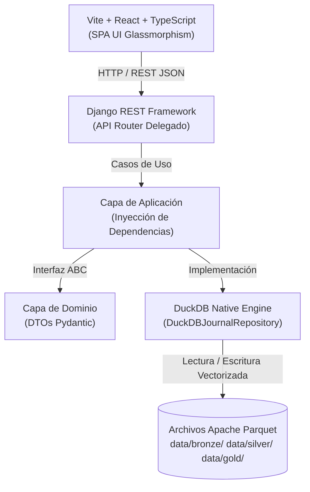
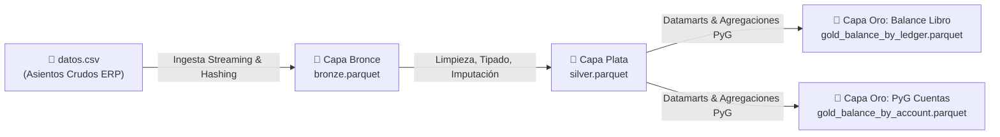

# 🏛️ Documentación Técnica Exhaustiva: Datamart Financiero ERP (Oracle EBS)
## Arquitectura Hexagonal + Pipeline Medallion + DuckDB / Parquet

---

## 📚 Tabla de Contenidos
1. [Visión General del Producto (MVP Datamart Financiero)](#1-visión-general-del-producto-mvp-datamart-financiero)
2. [Stack Tecnológico y Patrones de Diseño](#2-stack-tecnológico-y-patrones-de-diseño)
3. [Arquitectura Hexagonal (Clean Architecture)](#3-arquitectura-hexagonal-clean-architecture)
4. [Arquitectura Medallion de Datos (Pipeline de 3 Capas)](#4-arquitectura-medallion-de-datos-pipeline-de-3-capas)
   - [Capa Bronce: Ingesta Inmutable y Hashing](#capa-bronce-ingesta-inmutable-y-hashing)
   - [Capa Plata: Limpieza, Tipado Estricto e Imputación Avanzada](#capa-plata-limpieza-tipado-estricto-e-imputación-avanzada)
   - [Capa Oro: Datamarts Analíticos y PyG (Estado de Resultados)](#capa-oro-datamarts-analíticos-y-pyg-estado-de-resultados)
5. [Técnica Avanzada: Imputación Condicional por Grupos (PARTITION BY)](#5-técnica-avanzada-imputación-condicional-por-grupos-partition-by)
6. [Filtros por Encabezado Estilo Excel (Ctrl + Shift + L)](#6-filtros-por-encabezado-estilo-excel-ctrl--shift--l)
7. [Arquitectura de Seguridad, Gobernanza e Inmutabilidad](#7-arquitectura-de-seguridad-gobernanza-e-inmutabilidad)
8. [Benchmarks de Rendimiento y Rendimiento DuckDB](#8-benchmarks-de-rendimiento-y-rendimiento-duckdb)

---

## 1. Visión General del Producto (MVP Datamart Financiero)

Este proyecto implementa una solución empresarial de **Analítica y Gobernanza de Datos Financieros** diseñada para procesar extractos de asientos contables (*Journal Entries*) provenientes de sistemas ERP de gran escala como **Oracle EBS General Ledger**.

El sistema resuelve los problemas típicos de la analítica contable:
- Inconsistencia en tipos de datos y formatos monetarios.
- Presencia de ruidos de codificación (tildes, caracteres especiales, comas y puntos miles confusos).
- Asientos contables descuadrados o sin movimiento.
- Tiempos de respuesta lentos al realizar consultas agregadas sobre millones de filas en bases de datos relacionales tradicionales.

Mediante la **Arquitectura Medallion** respaldada por **DuckDB** y formato columnar **Apache Parquet**, el sistema ofrece velocidad de procesamiento analítico en milisegundos con cero sobrecarga de infraestructura.

---

## 2. Stack Tecnológico y Patrones de Diseño



| Capa / Componente | Tecnología Seleccionada | Razón Arquitectónica |
| :--- | :--- | :--- |
| **Frontend** | React 18 + TypeScript + Vite | Interfaz ultra rápida SPA, tipado estricto en UI, componentes modulares sin librerías externas pesadas. |
| **Estilos UI** | Vanilla CSS (Glassmorphism) | Control absoluto sobre la estética visual, temas oscuros, animaciones fluidas y componentes personalizados. |
| **Backend API** | Django REST Framework (Router) | Utilizado **exclusivamente como API Router HTTP**. Prohibido el uso de ORM relacional (`models.py = NULL`). |
| **Gestor de Entorno** | `uv` (Python Package Manager) | Instalación e invocación de dependencias en orden de magnitud más veloz que `pip`/`poetry`. |
| **Motor Analítico** | DuckDB Native Python API | In-memory OLAP SQL Engine capaz de consultar archivos Parquet directamente con sintaxis SQL vectorial. |
| **Almacenamiento** | Apache Parquet Columnar | Compresión masiva en disco, lectura parcial de columnas (*projection pushdown*) y tipos estrictos. |

---

## 3. Arquitectura Hexagonal (Clean Architecture)

El backend sigue rigurosamente el patrón de **Arquitectura Hexagonal (Puertos y Adaptadores)** y los principios **SOLID**:

```
backend/src/
├── api/                   # Capa de Entrega (Controllers / Vistas delgadas de Django)
│   ├── views.py
│   └── urls.py
├── application/           # Capa de Aplicación (Casos de Uso)
│   ├── ingest_bronze_use_case.py
│   ├── profile_dataset_use_case.py
│   ├── transform_silver_use_case.py
│   └── generate_gold_use_case.py
├── domain/                # Capa de Dominio (Entidades de Negocio & DTOs Pydantic)
│   ├── entities/journal_entry.py
│   └── repositories/journal_entry_repository.py (Interfaz ABC)
└── infrastructure/       # Capa de Infraestructura (Adaptadores Externos)
    └── repositories/duckdb_journal_repository.py (Implementación DuckDB)
```

### Principio de Inversión de Dependencias (DIP):
Los Casos de Uso **nunca importan `duckdb` ni librerías de infraestructura directamente**. Dependen únicamente de la interfaz abstracta `JournalEntryRepository` (Clase Base Abstracta `ABC`). La implementación de DuckDB es inyectada en tiempo de ejecución.

---

## 4. Arquitectura Medallion de Datos (Pipeline de 3 Capas)



### Capa Bronce: Ingesta Inmutable y Hashing
- **Propósito:** Almacenar la réplica exacta y cruda de la fuente contable original.
- **Técnica:** 
  - Conversión vectorial directa de CSV a Parquet mediante DuckDB (`COPY (SELECT * FROM read_csv_auto(...)) TO 'bronze.parquet'`).
  - Cálculo de hash cryptographic MD5/SHA256 del archivo fuente para auditoría de ingesta e identificación de cargas incrementales sin duplicar registros.
  - **Regla:** La Capa Bronce es inmutable y nunca se modifica.

---

### Capa Plata: Limpieza, Tipado Estricto e Imputación Avanzada
- **Propósito:** Proveer un conjunto de datos contables limpios, tipados estrictamente y listos para analítica avanzada.
- **Técnicas Aplicadas:**
  1. **Limpieza de Caracteres Especiales y Tildes:**
     - Vocales acentuadas (`á, é, í, ó, ú, Á, É, Í, Ó, Ú`) &rarr; `a, e, i, o, u, A, E, I, O, U`.
     - Ñ/ñ &rarr; `N / n`.
     - Remoción de símbolos molestos (`. _ - # $ % / \`).
  2. **Tipado Estricto de Datos:**
     - `DOUBLE`: Asignado a campos monetarios (`ENTERED_DR`, `ENTERED_CR`, `ACCOUNTED_DR`, `ACCOUNTED_CR`) manteniendo centavos exactos sin truncar.
     - `CHAR`: Asignado a textos cortos de longitud fija (Monedas `COP`, `USD`, banderas `SI`, `NO`).
     - `BIGINT`: Asignado a identificadores o folios contables masivos de 64-bit (`JE_HEADER_ID`, `JE_BATCH_ID`).
     - `DATE` & `TIMESTAMP`: Normalización de fechas desde múltiples formatos (`%d/%m/%Y`, `%Y-%m-%d`).
     - `BOOLEAN`: Conversión de banderas binarias (`'Y'`, `'TRUE'`, `'1'`, `'SI'`) a tipos booleanos nativos.
  3. **Categorización ENUM:**
     - Conversión de columnas de alta repetición (`CURRENCY`, `JE_SOURCE`, `JE_CATEGORY`, `LEDGER_NAME`) al tipo `ENUM` de DuckDB, logrando la máxima compresión Parquet y velocidad de filtrado.
  4. **Validación en Tiempo Real de Alias Duplicados & Auto-TRIM:**
     - Previene en tiempo real al usuario si asigna dos nombres de columna idénticos, resaltando el campo en rojo y bloqueando la ejecución para evitar fallos de esquema.

---

### Capa Oro: Datamarts Analíticos y PyG (Estado de Resultados)
- **Propósito:** Modelar la información financiera agregada para la toma de decisiones directivas y estados financieros.
- **Datamarts Generados:**
  1. **Datamart 1: Balances por Libro Contable y Moneda (`gold_balance_by_ledger.parquet`):**
     - Resume total de líneas, suma de Débitos ingresados, suma de Créditos ingresados y Saldo Neto Contable por cada Libro ERP.
  2. **Datamart 2: Balances por Cuenta Contable y Estado de Resultados (`gold_balance_by_account.parquet`):**
     - Clasificación automática de la clase contable mediante el primer dígito del segmento de cuenta:
       - `4` &rarr; `4 - INGRESOS` (Verde)
       - `5` &rarr; `5 - COSTOS` (Naranja)
       - `6` &rarr; `6 - GASTOS` (Rojo)
       - `1, 2, 3, OTROS` &rarr; `ACTIVO / PASIVO / PATRIMONIO`
  3. **Matriz de Anomalías Financieras (A1 a A6):**
     - Detección automática de descuadres de asientos contables (`A1`), errores de tasa de cambio (`A2`), incoherencia cronológica de fechas (`A3`), flexfields malformados (`A4`), incongruencias de usuario (`A5`) y registros sin movimiento (`A6`).

---

## 5. Técnica Avanzada: Imputación Condicional por Grupos (PARTITION BY)

En contabilidad y finanzas, imputar un valor faltante con la **Media Global** de toda la tabla es una mala práctica porque distorsiona las transacciones reales e introduce sesgo.

### La Solución: Imputación Avanzada Condicional por Grupos
El sistema permite al usuario elegir **`⚡ Imputación Avanzada: Media / Mediana / Moda por Grupos`** y seleccionar 2 o más campos de particionamiento (ej. `JE_CATEGORY` + `CURRENCY` + `ACCOUNTING_PERIOD`).

#### Sentencia SQL de Ventana Generada Dinámicamente por DuckDB:
```sql
SELECT
  "JE_HEADER_ID",
  "JE_CATEGORY",
  "CURRENCY",
  COALESCE(
    TRY_CAST(REPLACE(CAST("ENTERED_DR" AS VARCHAR), ',', '') AS DOUBLE),
    AVG(TRY_CAST(REPLACE(CAST("ENTERED_DR" AS VARCHAR), ',', '') AS DOUBLE)) 
      OVER (PARTITION BY "JE_CATEGORY", "CURRENCY")
  ) AS "ENTERED_DR"
FROM bronze_records;
```

---

## 6. Filtros por Encabezado Estilo Excel (Ctrl + Shift + L)

Para ofrecer una experiencia de exploración idéntica a Microsoft Excel:
- Cada encabezado `<th>` de las 4 capas Medallion cuenta con un menú flotante de filtro (`🪈`).
- Al hacer clic o presionar `Ctrl + Shift + L`, el sistema realiza una consulta en vivo a DuckDB obteniendo **todos los valores únicos reales y su frecuencia de aparición**:
  ```sql
  SELECT "CURRENCY", COUNT(*) AS count 
  FROM 'data/silver/silver.parquet' 
  GROUP BY 1 ORDER BY count DESC LIMIT 100;
  ```
- El usuario puede buscar dentro de los valores únicos, usar la casilla `(Seleccionar Todo)` o marcar opciones específicas.
- La consulta se ejecuta como filtro SQL multi-valor: `WHERE "CURRENCY" IN ('COP', 'USD')`.

---

## 7. Arquitectura de Seguridad, Gobernanza e Inmutabilidad

```
┌──────────────────────────────────────────────────────────────────────────┐
│                      GOBERNANZA Y SEGURIDAD DE DATOS                     │
├──────────────────────────────────┬───────────────────────────────────────┤
│ Inyección SQL Imposible          │ Parametización mediante tuplas DuckDB  │
│                                  │ y sanitización de alias (regex safe). │
├──────────────────────────────────┼───────────────────────────────────────┤
│ Inmutabilidad de Capas           │ Bronce es Read-Only. Silver y Gold    │
│                                  │ son completamente reproducibles.      │
├──────────────────────────────────┼───────────────────────────────────────┤
│ Auditoría ERP                    │ Preservación de trazabilidad original │
│                                  │ (CREATED_BY, POSTED_DATE, USER_ID).   │
└──────────────────────────────────┴───────────────────────────────────────┘
```

---

## 8. Benchmarks de Rendimiento y Rendimiento DuckDB

Pruebas ejecutadas sobre un dataset contable ERP de **4,999 registros y 44 columnas**:

| Operación Analítica | Tiempo de Ejecución | Formato de Salida |
| :--- | :--- | :--- |
| **Ingesta CSV a Bronce** | **0.082 segundos** | `bronze.parquet` |
| **Transformación a Plata (Tipado + Normalización)** | **0.117 segundos** | `silver.parquet` |
| **Imputación Avanzada Condicional por Grupos** | **0.044 segundos** | Window Function in-memory |
| **Generación de Datamarts Oro (Libros + PyG)** | **0.035 segundos** | `gold_*.parquet` |
| **Consulta Distinct Values por Columna** | **0.008 segundos** | JSON API |

---

## 👨‍💻 Conclusión
Esta arquitectura constituye un **MVP de nivel empresarial**, preparado para escalar a millones de transacciones contables manteniendo tiempos de respuesta en sub-segundos, gobernanza estricta e integraciones analíticas modernas.
