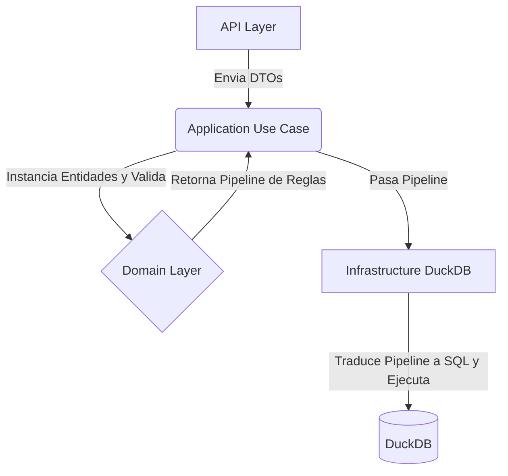
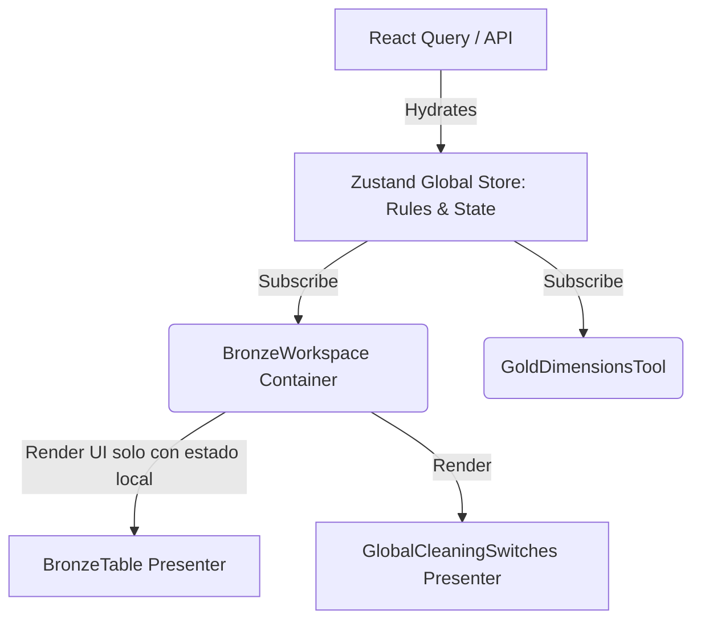

# Auditoría Arquitectónica y Feedback (Nivel Experto)

Este documento eleva el análisis de la arquitectura actual del proyecto para abordar problemas estructurales profundos de diseño de software. Aunque el proyecto es funcional como MVP, el análisis del código fuente revela violaciones significativas a los principios SOLID, problemas en la implementación de Domain-Driven Design (DDD) y un acoplamiento extremo en la capa de presentación.

---

## 1. Análisis del Backend: Falsa Arquitectura Hexagonal y "Anemic Domain Model"

El backend intenta usar una Arquitectura Hexagonal (Puertos y Adaptadores) y Diseño Guiado por el Dominio (DDD), pero la implementación actual tiene defectos conceptuales graves.

### A. Modelo de Dominio Anémico (Anemic Domain Model)
En `src/domain/entities/journal_entry.py`, las supuestas "Entidades" son en realidad Data Transfer Objects (DTOs) puros impulsados por Pydantic (e.g., `TransformationRulesDTO`, `CalculatedFieldRuleDTO`).
> [!CAUTION]
> **Anti-patrón:** En DDD, la capa de dominio debe contener las **reglas de negocio**. Actualmente, tus entidades son "anémicas" (solo tienen propiedades y no comportamiento). Las decisiones de negocio (cómo se evalúa una regla matemática, qué pasa si falta una dimensión) no están en el Dominio.

### B. Infraestructura "Demasiado Inteligente" (Smart Infrastructure)
La lógica de negocio se ha filtrado completamente a la capa de Infraestructura.
Si observamos `infrastructure/duckdb/silver_service.py` o `gold_service.py`, vemos que estos servicios de base de datos están tomando decisiones de negocio:
- Evalúan tipos de imputación (`MEAN`, `MEDIAN`).
- Resuelven operaciones aritméticas de reglas (`SUM`, `SUBTRACT`).
- Deciden qué hacer con los campos calculados.

> [!WARNING]
> **Violación de Responsabilidades:** La infraestructura (DuckDB) **solo debería ejecutar SQL o comandos de almacenamiento**. La construcción del AST (Abstract Syntax Tree) de reglas o la decisión de qué regla aplicar debería ocurrir en la Capa de Dominio o de Aplicación.

### C. Casos de Uso "Pass-through" (Application Layer inútil)
Archivos como `application/use_cases/generate_gold_use_case.py` simplemente reciben la llamada y la pasan al repositorio: `return self.repository.generate_gold_models(...)`. No hay orquestación de dominio real.

### 💡 Propuesta de Delegación (Backend)
Debes invertir la dependencia de la lógica:
1. **Dominio:** Las reglas (e.g. `MathRule`, `ImputationRule`) deben vivir en el dominio y tener un método `evaluate()` o `to_ast()`.
2. **Aplicación:** El Use Case debe recibir el DTO, convertirlo en entidades de dominio (`TransformationPipeline`), validarlo y luego pasárselo a la Infraestructura.
3. **Infraestructura:** Un traductor (`DuckDBSqlTranslator`) simplemente toma el pipeline del dominio ya validado y lo convierte en un string SQL ciego.

---

## 2. Análisis del Frontend: El "God Component" y Prop Drilling Extremo

El anidamiento en el frontend no es un simple problema de identación, es un problema de delegación de responsabilidades de estado.

### A. Componentes Monolíticos ("God Components")
`App.tsx` y `BronzeWorkspace.tsx` están haciendo demasiadas cosas a la vez:
1. Gestionan el estado (useState, Zustand hooks).
2. Manejan lógica de red (Mutations, Queries).
3. Contienen lógica de UI condicional compleja.
4. Delegan masivamente hacia abajo (Prop Drilling).

En `BronzeWorkspace.tsx`, la firma de propiedades (Props) tiene más de 30 variables inyectadas. Esto indica que el componente hijo depende de que su componente padre sepa todo sobre la vida de la aplicación.

### B. Falta de Separación UI / Lógica de Negocio
> [!CAUTION]
> **Anti-patrón:** La UI está atada directamente a la manipulación de los datos (e.g., `handleSuggestedCleaning` en `BronzeWorkspace.tsx`). La vista debe ser lo más tonta posible (Dumb Components).

### 💡 Propuesta de Delegación (Frontend)

Debes aplicar el patrón **Container/Presenter** (o usar de manera estricta un gestor de estado atómico como Zustand/Jotai o Feature Slices con Redux):

1. **Estado Centralizado (Zustand):** Toda la lógica de "Reglas de Limpieza" (globales, por columna, divisiones) debe vivir en un `useCleaningStore`.
2. **Componentes Presentacionales (Dumb):** Un componente como `SilverColumnRow` no debe recibir callbacks inyectados desde `App.tsx`. Simplemente debe hacer: `const updateRule = useCleaningStore(s => s.updateRule)`.
3. **Hooks de Orquestación:** Extraer la lógica compleja (como el análisis sugerido de columnas) a custom hooks dedicados (e.g., `useBronzeHeuristics`).

---

## 3. Plan de Acción (Decisiones a tomar)

Si queremos que el sistema escale sin que el código colapse bajo su propio peso de anidamiento, debes decidir implementar esto en las próximas iteraciones:

1. **Refactorización del Frontend (Patrón Atómico de Estado):**
   - *Decisión:* Migrar toda la gestión de reglas de `App.tsx` a un Store de Zustand en un archivo `store/medallionStore.ts`.
   - *Impacto:* Reducirá las props de los componentes en un 80% y eliminará el anidamiento de componentes.

2. **Refactorización del Backend (Visitor Pattern para DuckDB):**
   - *Decisión:* Quitar los interminables `if/elif` de `silver_service.py` y crear un Patrón Visitor o Builder. El servicio de infraestructura solo debe recibir un árbol de instrucciones y traducirlo a strings.
   - *Impacto:* Resolverá la complejidad ciclomática masiva y facilitará hacer tests unitarios sobre el SQL generado sin arrancar DuckDB.

3. **Curar el Modelo Anémico:**
   - *Decisión:* Mover los métodos lógicos que actualmente viven perdidos en la UI o en los servicios de DuckDB y convertirlos en métodos reales de clases dentro de `src/domain/entities/`.
   - *Impacto:* El negocio se vuelve agnóstico a DuckDB o React. Si mañana cambias DuckDB por Spark, las reglas de dominio (tu verdadero core de limpieza) no cambian ni una línea.
